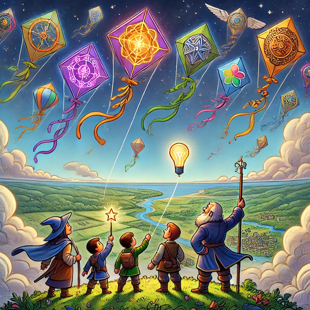

# 🪁 Updraft

## Overview

Updraft is a way for people to get paid to discover the best ideas for their communities, their organizations and the world.

This guide will teach you the concepts you need to know to make an impact in Updraft.

<figure><figcaption></figcaption></figure>
