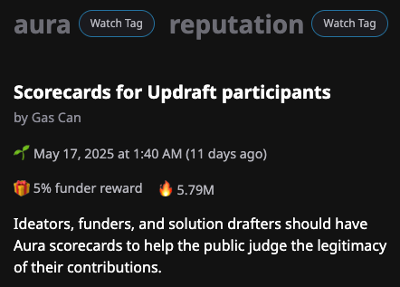
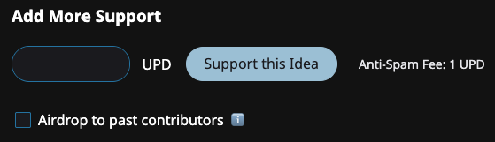

# 🚀 Campaigns

Campaigns are funds committed to promote a theme or topic.

## Tasks Section

Campaigns are visible in the Tasks section of the home page. They are ordered by the value of the committed funds.

## Creating a campaign

Make a proposal in the [campaigns channel of the Updraft discord](https://discord.gg/w8At3Vd74K) to create a campaign.

When creating a campaign, please provide

* Campaign name
* Description
* Image
* Link that provides more info for participants
* Committed funds.
  * Which tokens besides UPD are you including in your committed funds? Committing funds in a community token are a great way to encourage drafters to accept funding in that token.
  * Which wallet addresses will distribute the funds?
* Tag combination
  * What tag combination should people apply to their Ideas and Solutions to take part in the campaign? — For example, a campaign to build reputation solutions for Aura, might use "aura" and "reputation" as its tags.

## Applying committed funds

### Finding Ideas and Solutions

Clicking the action button on the Campaign card in the Tasks section will take participants to the "search by tags" results for the tag combination used by the Campaign.

<figure><figcaption></figcaption></figure>

Ideas using your tag combination are ordered by 🔥, which signifies community interest.


[sort-order.md](sort-order.md)


### Airdrops

An airdrop is a great way to reward participants for showing interest in your campaign, and one of the two main ways of using committed funds.

<figure><figcaption></figcaption></figure>

Just below the "Fund" button is a checkbox for "Airdrop". By using this checkbox, you're forgoing funder rewards and airdropping the entire amount of your transaction on past supporters of this Idea.

Like other Idea funding, airdrops are done using UPD.

### Funding Solutions

Idea pages list Solutions that have been proposed for that Idea. Each Solution represents a concrete proposal to implement an Idea.

You should use your committed funds to fund high quality Solutions that are nearing their funding deadline.
