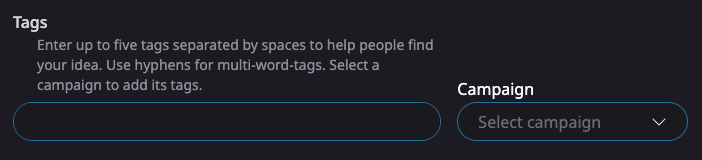

# 🚀 Campaigns

<figure><figcaption>
A Campaign Card
</figcaption></figure>

Campaigns direct attention toward a theme or topic by committing funds to reward participants through _airdrops_ and funding solutions.

## Tasks Section

Campaigns are visible in the Tasks section of the home page. They are ordered by the value of the committed funds.

## Creating a Campaign

Start in the [campaigns channel of the Updraft discord](https://discord.gg/w8At3Vd74K) to fill the form to create a campaign.

Information you can include:

* Campaign name
* Description
* Image
* Link that provides more information for participants
* Committed funds.
  * Which tokens besides UPD are you including in your committed funds? Committing funds in a community token are a great way to encourage drafters to accept funding in that token.
  * Which wallet addresses will distribute the funds?
* Tag combination
  * What tag combination should people apply to their Ideas and Solutions to take part in the campaign? — For example, a campaign to build reputation solutions for Aura, might use "aura" and "reputation" as its tags.

## Finding Ideas and Solutions related to a Campaign

Clicking the action button on the Campaign leads to the "search by tags" results for the tag combination used by the Campaign.

<figure><figcaption></figcaption></figure>

Ideas using your tag combination are ordered by 🔥, which signifies community interest.

## Campaign Ideas

When creating an Idea, there's an option for creators to join your campaign by using its tags.

<figure><figcaption>
Select a Campaign to add its tags to your Idea
</figcaption></figure>

## Applying Committed Funds

### Airdrops

Airdrops are one of the two main ways to use committed funds to reward participants for showing interest in your campaign.

<figure><figcaption></figcaption></figure>

On an Idea page, just below the "Support Idea" button is a checkbox for "Airdrop". By using this checkbox, you airdrop the entire amount of your transaction to past supporters of this Idea.

Like other Idea funding, airdrops are done using UPD.

### Funding Solutions

Idea pages list Solutions that have been proposed for that Idea. Each Solution represents a concrete proposal to implement the Idea.

You should use your committed funds to fund high quality Solutions that are nearing their funding deadline.
