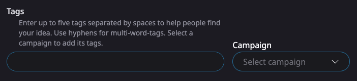

# 🔆 Creating an Idea

<figure><figcaption>
It's easy to create an Idea on Updraft
</figcaption></figure>

If you have an Idea that no one has created yet, feel free to create it yourself.

Choose an amount of UPD to deposit; the more you deposit, the more you stand to earn. You can withdraw 99% of your deposit (1% acts as anti-spam protection and goes to fund the faucet which helps people get started using Updraft.)

You'll earn funder rewards on your deposit, just like you would supporting someone else's Idea.

To increase your chance of earning money, consider joining a [campaign](../advanced-topics/campaigns.md) by adding certain tags to your Ideas. Campaign creators commit to airdrop UPD on Ideas that use their tags. You can select a campaign to automatically add its tags. Otherwise, you can use any tags you want to help people find your Idea.

<figure><figcaption></figcaption></figure>

