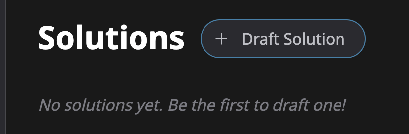

# 📃 Drafting a Solution

Once you have a concrete plan to implement an Idea, you can draft a Solution from an Idea page.

<figure><figcaption>
Draft a Solution from an Idea Page
</figcaption></figure>


You may already have a Solution in mind when you create an Idea. It's perfectly fine to draft a Solution to your own Idea.


## Funding parameters

When drafting a Solution, you'll need to answer the following questions.

* How much funding do you need?
  * You can raise a small amount to accomplish the first milestone of your Solution and then extend the funding goal and deadline.
* What token do you want people to fund with? (The default is UPD.)
  * Choose a token that will be convenient for funders. Everyone on Updraft will already have UPD. You can also choose a token with a stable value (a stablecoin) to make sure the goal amount doesn't change during the fundraising period.
* How much time do you need to raise the required funds (deadline)?
  * Shorter deadlines are attractive to funders because they know they can get a refund sooner if the goal fails.
* How many tokens should you stake?
  * A stake is an optional way to increase the chance of funding by offering an additional reward if the goal isn't met.
* How high should you set the funder reward?
  * A funder reward allows funders to earn a percentage of contributions that come after theirs. Setting this is a balance between rewarding funders and leaving more for your Solution.


[funder-rewards.md](funder-rewards.md)

