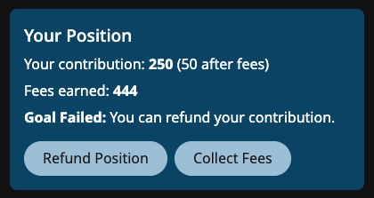

# 💸 Funding a Solution

If someone has a concrete plan to implement an Idea, they can draft a Solution to raise funds.

## 🎁 Funder rewards&#x20;

Solution drafters can offer funder rewards.


[funding-rewards.md](funding-rewards.md)


Funders can collect any rewards they've earned since the last time they collected.

## 💎 Stake

Drafters can offer another incentive to funders known as a _stake_. A stake is divided among funders in proportion to their contributions if the Solution doesn't reach its funding goal by the deadline set by the drafter.

Funders can add to the stake to entice other funders.

Anyone who staked gets their full stake returned if a Solution is reaches its funding goal.

## Reaching a funding goal

When a funding goal is reached:

* The drafter can claim the funds in the solution fund.
* Anyone who staked can reclaim their stake.
* The drafter can choose to set a new funding goal and extend the deadline.


If a Solution Drafter extends their funding goal, they automatically claim all funds up to that point. All funders' positions remain intact, however, and continue to grow in earning potential.


## Failing a funding goal

When a funding goal is not reached by the deadline set by the drafter, funders can claim a full refund plus their portion of the 💎 stake.

<figure><figcaption>
Refunding a Position
</figcaption></figure>


Funders of a failed goal can also collect any remaining 🎁 funder rewards they earned.

