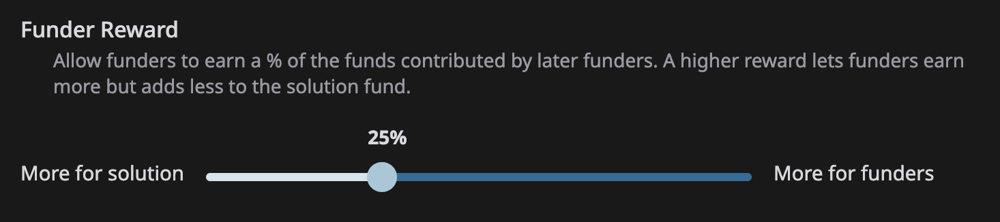

# 🎁 Funding rewards

Funding rewards are a source of income for Updraft participants. They allow people who create or support good Ideas to earn--even if they don't implement the Idea themselves.


When an Idea or Solution offers a funding reward, you will see a gift 🎁 icon followed by a percentage. The percentage is the amount of each contribution that goes to previous contributors.


## Funding reward amount

When someone creates an Idea, the funding reward is set to 5% by default.

When someone drafts a Solution,  they can choose any percentage for the funding reward. Their choice creates a balance between allowing funders to earn and directly funding the Solution.

<figure><figcaption></figcaption></figure>

## Paying the fee

If an Idea or Solution has a Funding Reward, you will pay that amount as a % fee when you make a contribution. It will be automatically deducted from your contribution transaction.


Funders and supporters that contribute during the first _cycle_ of a new Idea or Solution (usually the first 12 hours), do not pay the funding reward fee. This also applies to the creator of an Idea.


## Determining earnings

How much you earn depends on three factors.

* The size of your contribution compared to other contributions.
* How much time passed since you made your contribution.


Earning potential increases linearly with each _cycle._ A cycle is a time period used for calculating rewards. For most Ideas and Solutions, each cycle lasts 12 hours.



Contributors in the same cycle earn at the same rate, proportional to their contribution. This prevents _front-running,_ where an attacker pays extra network fees to put a transaction ahead of another one after they've seen it.


* How much is contributed after your contribution.

### For Supporting Ideas

After you've supported an idea, you can see your _position_ in that Idea, which tells you how much you've earned after subtracting the fees you paid.

As a general rule, if more support is added to an Idea after your contribution than was added before, you will earn a profit.

### For Funding Solutions

