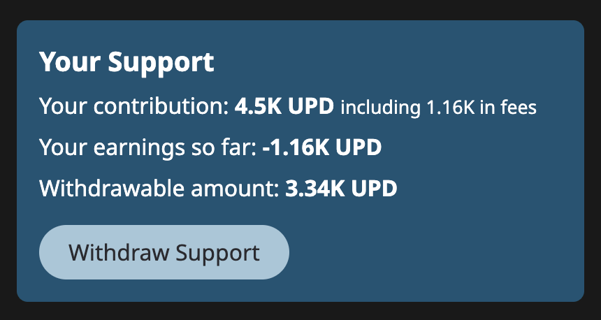
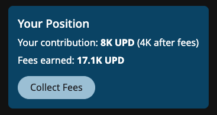

# 🎁 Funder rewards

Funder rewards are a source of income for Updraft participants. They allow people who create or support good Ideas to earn--even if they don't implement the Idea themselves.


When an Idea or Solution offers a funder reward, you will see a gift 🎁 icon followed by a percentage. The percentage is the amount of each contribution that goes to previous contributors.


## Funder reward amount

When someone creates an Idea, the funder reward is set to 10% by default.

When someone drafts a Solution,  they can choose any percentage for the funder reward. Their choice creates a balance between allowing funders to earn and directly funding the Solution.

<figure><figcaption></figcaption></figure>

## Paying the fee

If an Idea or Solution has a funder reward, you will pay that amount as a % fee when you make a contribution. It will be automatically deducted from your contribution transaction.


Contributions in the first _cycle_ of a new Idea or Solution (usually the first 12 hours) don't pay a Funder Reward fee. Idea creators also don't pay this fee.


## Determining earnings

How much you earn depends on three factors.

* The size of your contribution compared to other contributions.
* How much time passed since you made your contribution.


Earning potential increases linearly with each _cycle._ A cycle is a time period used for calculating rewards. Each cycle lasts 12 hours.



Contributors in the same cycle earn at the same rate, proportional to their contribution. This prevents _front-running,_ where an attacker pays extra network fees to put a transaction ahead of another one after they've seen it.


* How much is contributed after your contribution.

### For supporting Ideas

After you've supported an idea, you can see your _position_ in that Idea, which tells you how much you've earned after subtracting the fees you paid.

<figure><figcaption>
Idea position
</figcaption></figure>


As a general rule, if more support is added to an Idea after your contribution than was added before, you will earn a profit.


### For funding Solutions

When you fund a Solution, part of your contribution goes to the Solution Fund and part of it goes to past contributors as funder rewards. These appear as "fees" in your Solution position.

<figure><figcaption>
Solution position
</figcaption></figure>


You will start to earn funder rewards in the next cycle (12 hours).


You can collect funder rewards from the Solution page as you earn them.
