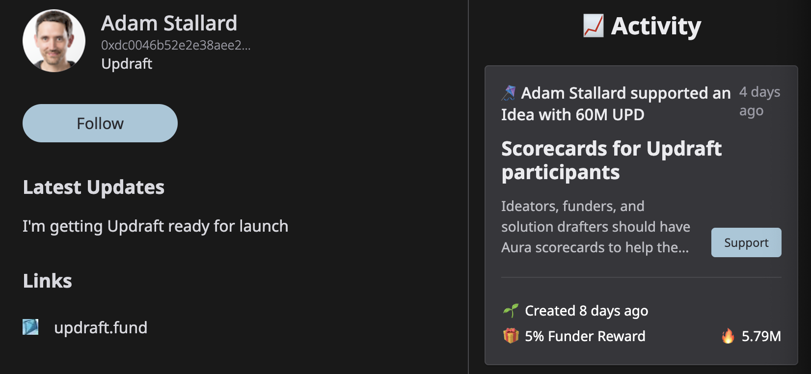
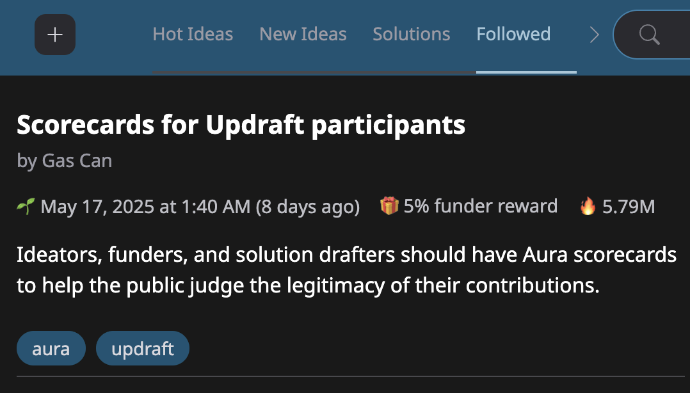

# 👥 Profiles

Profiles let people and teams share updates and activities with other participants on Updraft.

In your profile, you can share what you're working on and what you're passionate about, so that other people with similar interests can follow your activity and know what Solutions and Ideas to support.

<figure><figcaption>
Profile view
</figcaption></figure>

Each profile is associated with a unique public address (of the form `0x...`) that was created with a wallet and lets people distinguish you from an imposter.


[using-a-wallet.md](using-a-wallet.md)



You can have separate profiles for yourself and each organization or team you work on. Each person and team has their own unique wallet address.


## Following

Following a person or team adds their activity to the "Followed" tab of the discover page, so you can easily find Ideas supported by those you follow.

<figure><figcaption>
Followed tab
</figcaption></figure>

