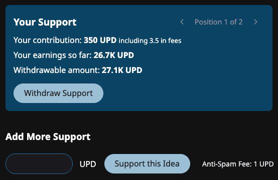

# ✅ Supporting an Idea

When you support an Idea, you show that you would like to see it implemented. You raise awareness for it by your support. The Idea's 🔥 interest increases, which makes it more visible to other people, and more likely that people will draft Solutions for it.

You also have the potential to earn 🎁 funder rewards for creating or supporting an Idea.


[funding-rewards.md](funding-rewards.md)


## Positions

Each time you support an Idea, you create a _position_ in that Idea.

<figure><figcaption>
An Idea Position
</figcaption></figure>

When you withdraw from a position, you receive your original contribution, minus any 🎁 funder reward and anti-spam fees you paid, plus any amount you earned from 🎁 funder rewards.


The default 🎁 funder reward for Ideas is 10%. The anti-spam fee is typically 1%.


### Multiple positions

Because the earning potential of a position increases over time, when you add more support, you create another position. Each position must be withdrawn separately.

<figure><figcaption>
Multiple Idea Positions
</figcaption></figure>
