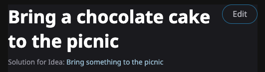
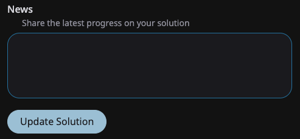
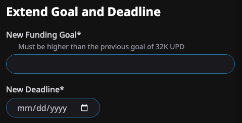

# ⚒️ Updating a Solution

You can edit a Solution you drafted from its page to provide news to your funders or to extend a goal after it's been reached.

<figure><figcaption>
Edit a solution
</figcaption></figure>

## Providing news

Use the "news" field of the edit form to let funders know about your progress. They will see the update on their home page in the "Updates" section.

<figure><figcaption></figcaption></figure>

## Extending a goal

If your solution reaches its goal, you have the opportunity to extend the goal and the deadline.


If you extend a goal:

* all previously contributed funds will automatically be withdrawn to your wallet.
* all funders' positions will remain intact and continue to grow in earning potential.


<figure><figcaption></figcaption></figure>
