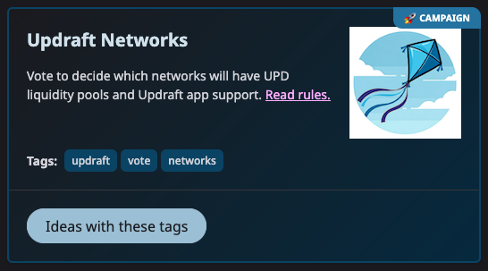

# 🗳️ Voting

Ideas on Updraft can be used for voting, as follows.

1. Someone interested in holding a vote creates a [Campaign](../advanced-topics/campaigns.md) and a set of tags that Ideas should use to be included as choices in the vote.
2. Participants create choices by [creating Ideas](../basics/creating-an-idea.md) with the Campaign's tags. They can do this easily by selecting the Campaign when creating the Idea.

<figure><figcaption>
Select a Campaign to add its tags to your Idea
</figcaption></figure>

3. The creator of an Idea makes a deposit which counts toward the Idea's vote total.
4. Other participants [support the Idea](../basics/supporting-an-idea.md), also adding to its vote total.
5. Choices (Ideas) are ordered by 🔥interest at the end of the voting period.

Click the Campaign button to show choices (Ideas) that have already been created.

<figure><figcaption>
Click the button to see choices for this vote.
</figcaption></figure>

Because choices are Ideas, early supporters of a choice can earn [🎁 funder rewards](../basics/funding-rewards.md) from later voters.

See [Attention Streams](https://docs.google.com/document/d/1TKA-K8YadRdgz-Qek01TUcCkRaI9CKCXGtJ31AbVWIU/edit?usp=sharing) for a more detailed consideration of voting incentives.
